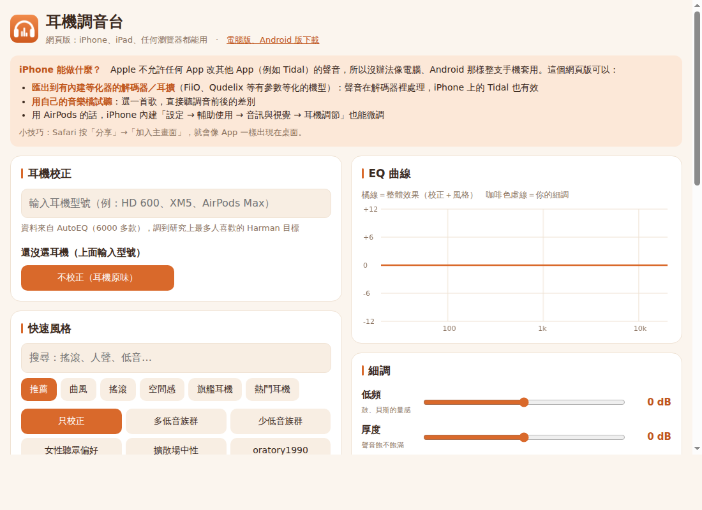

# 耳機調音台（Headphone Tuner）

用 [Equalizer APO](https://sourceforge.net/projects/equalizerapo/) 做系統層級耳機等化的前端。
耳機的頻率響應校正取自 [AutoEQ](https://github.com/jaakkopasanen/AutoEq)，目標曲線是 Harman 2018；
校正之上疊五個細調頻段和一組有出處的風格預設。介面是繁體中文。

另有兩個移植版：Android（`DynamicsProcessing`）和網頁版（匯出參數等化）。



網頁版畫面。桌面版與 Android 版用同一套資料（`docs/data.json`）和配色。

## 平台

| | Windows | Android | Web |
| --- | --- | --- | --- |
| 作用範圍 | 系統所有輸出 | 整機，或個別播放 App | 匯出設定；瀏覽器內試聽 |
| AutoEQ 校正 | 有 | 有 | 有 |
| 風格、細調、A/B | 有 | 有 | 有 |
| 聲場寬度、交叉饋送、殘響 | 有 | 無 | 無 |
| 取得 | [Releases](../../releases/latest) | [Releases](../../releases/latest) | https://benjaminwz.github.io/headphone-tuner/ |

## 安裝（Windows 10/11）

1. 安裝 Equalizer APO，在最後的 Configurator 勾選你要用的輸出裝置，重新開機。
2. 從 [Releases](../../releases/latest) 執行 `HeadphoneTuner-Setup-<版本>.exe`。
   安裝程式會在自己的資料夾放一份 Python，不使用系統的，也不需要管理員權限。
   解除安裝時還原 Equalizer APO 的 `config.txt`。
3. 開啟後選耳機。右上角顯示「EQ 已接上」才表示聲音有經過調音。

不想用安裝程式：下載 `headphone-tuner-<版本>.zip`，需要自備 Python 3 與 tkinter，執行 `安裝.bat`。
疑難排解與手動還原見 [說明.txt](說明.txt)。

Android 版需要 Android 10 以上；第一次安裝要允許未知來源。

## 運作方式

### 訊號鏈

```
音源 → [Preamp] → [AutoEQ 校正 + 細調 + 風格] → [交叉饋送] → [聲場寬度] → [平衡] → [殘響] → 輸出
```

調音台本身不處理音訊，只產生 Equalizer APO 的設定檔。改動會即時寫入，所以關掉視窗後聲音仍然有效。

### 設定檔

`config.txt` 開頭由調音台管理一個區塊（以標記包起來），每個用過的輸出裝置各有一段
`Device: <guid>` + `Include: tuner_<guid 前 8 碼>.txt`。原本的 `config.txt` 第一次修改前會備份成
`config_調音台之前的備份.txt`，原有的設定會被改成只套用在其他裝置，避免同一個裝置疊兩次。
藍牙耳機連上時由 Equalizer APO 依裝置代號自己選段，不需要調音台在執行。

### 校正

`耳機資料/` 快取 AutoEQ 的量測（oratory1990、crinacle、Rtings、Innerfidelity、Super Review、Headphone.com Legacy）。
每副耳機最多取三份；多份平均的做法是把各份濾波器的增益除以份數後疊在一起。
AutoEQ 沒有的型號（`ESTIMATED`）用同系列機種的量測推估，預設改用平均。

### 風格

風格是「目標曲線 − Harman 2018」的差，用 Gauss-Newton 擬合到五個二階濾波器：

| 頻段 | 類型 | 頻率 | Q |
| --- | --- | --- | --- |
| 低頻 | LSC | 105 Hz | 0.7 |
| 厚度 | PK | 250 Hz | 1.0 |
| 人聲 | PK | 1.5 kHz | 1.0 |
| 臨場感 | PK | 3.5 kHz | 1.2 |
| 高頻 | HSC | 10 kHz | 0.7 |

增益取 0.5 dB 的倍數，低頻上限 +6 dB。每個風格的依據（研究、標準或量測）寫在 `耳機調音台.pyw` 的資料表旁邊。
`filter_db()` 用的是 Equalizer APO 的 biquad 公式，所以畫面上的曲線與實際輸出一致。

### 音量空間

Preamp 固定為 `-(HEADROOM + extra)`。`HEADROOM` 由 `update_headroom()` 算出：
目前耳機的每一種校正與每個內建風格組合起來的最大正增益，進位到 0.5 dB，限制在 6–18 dB。
因此切換風格或開關 EQ 時音量不變，A/B 比較才公平，也不會削波。

### 空間處理

- 交叉饋送：中／側轉換後只衰減低頻側訊號，參數取 bs2b 的三組標準值（Meier、Chu Moy、bs2b 預設）。
- 聲場寬度：`L' = (1+k)L − kR`，`R'` 對稱。
- 殘響：依 DAC 目前取樣率產生脈衝響應檔，以 `Convolution:` 載入。錄音室取 ITU-R BS.1116 的條件；
  音樂廳的 RT60 約 2 s（Beranek），中段座位直達聲／殘響比少 3 dB。

### 輸出格式

位元深度與取樣率透過 `IPolicyConfig` 設定，不需要管理員權限。藍牙裝置的格式由 Windows 決定，這個選項對它無效。

### Android 與網頁

Android 版把同一條曲線取樣成 64 段 `DynamicsProcessing` 前置等化，加輸入增益（預留音量）與限幅器。
網頁版把曲線擬合成 5、8、10 或 15 段參數等化供匯出（給有內建 PEQ 的 DAC／耳擴），
並用 Web Audio 的 `BiquadFilter` 讓人用自己的檔案試聽。資料只存在瀏覽器的 localStorage。

## 限制

- 只有 Windows 版能處理系統聲音。iOS 不允許 App 修改其他 App 的輸出，網頁版因此只能匯出。
- 依賴 Equalizer APO；沒有在它的 Configurator 勾選的輸出裝置不會有效果。
- 藍牙若沒有效果，在 Equalizer APO Configurator 的 Troubleshooting options 改用 SFX/EFX 安裝方式。
- 藍牙耳機在通話模式（HFP，單聲道）下是另一個裝置，選裝置時要選立體聲那個。
- Tidal 歌單分析只讀本機的 Tidal 快取，不上傳；沒有安裝 Tidal 就不會出現。

## 目錄

```
耳機調音台.pyw       桌面版（Python、tkinter，單一檔案）
安裝.bat / 說明.txt   免安裝版入口與說明
installer/           Inno Setup 腳本與 build.py（打包安裝程式與 zip）
android/             Android 版（aapt2、javac、d8 直接建置，不用 Gradle）；gen_data.py 從桌面版匯出資料
docs/                網頁版（GitHub Pages）；data.json 與 android/assets/data.json 必須相同
tools/check.py       CI 檢查
```

## 建置

```
python 耳機調音台.pyw [--config-dir <資料夾>]     # --config-dir 寫到別處，不動系統音效設定
python installer/build.py v1.2.3 [--test]         # 需要 Inno Setup 6
python android/gen_data.py
powershell -ExecutionPolicy Bypass -File android\build_apk.ps1 -VersionCode 1 -VersionName 1.4.0   # 需要 JDK 17、Android SDK 35
python tools/check.py
```

桌面版改了風格資料之後，重跑 `android/gen_data.py` 並把 `android/assets/data.json` 複製到 `docs/data.json`。

## 授權

MIT。AutoEQ 資料同為 MIT。變更紀錄見 [CHANGELOG.md](CHANGELOG.md)，貢獻方式見 [CONTRIBUTING.md](CONTRIBUTING.md)。
